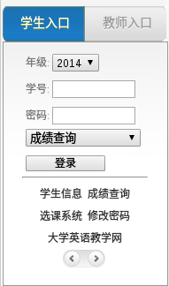
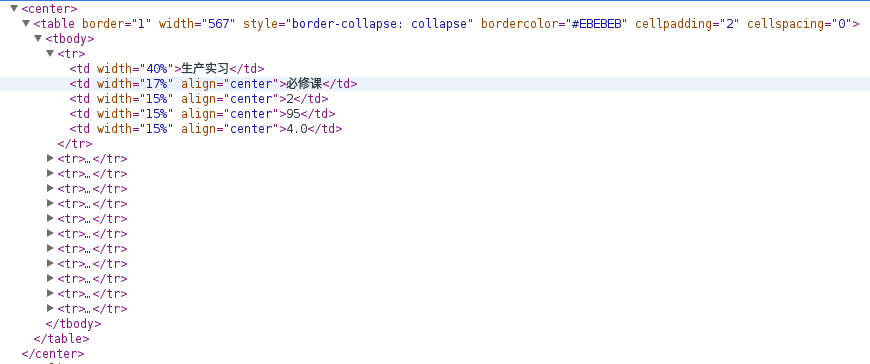

最近在学习爬虫的过程中，读了不少相关博文，感觉收获良多。

前两天刚刚动手写了一个爬取郑州大学个人成绩并计算平均绩点的程序，特意拿到这里来与大家分享。

虽然写的是针对郑州大学教务系统的爬虫，但我相信只要稍作修改就可以应用于多数大学的教务系统了。

首先说一下程序执行的过程：

> 1、打开教务系统登录界面，获取相应的`url`以及表单域需要填写选项的名称。

> 2、填写必要信息、设置`cookie`，模拟浏览器登录系统

> 3、利用正则表达式获取不同学期成绩页面对应的`url`，并保存。

> 4、循环打开刚刚保存的不同学期成绩页面的`url`，利用正则表达式匹配课程、成绩信息。

> 5、计算平均绩点并输出

从上面的流程可以看出，整个过程涉及到的比较复杂的地方只有登录以及正则表达式的匹配，下面我们一步一步实现我们的需求。

为了很好地讲解操作步骤，我们先设计一个类，名字叫做`ZZU`

并设置以下成员：


		
		#部分ZZU类成员
		self.cookies 	#cookie
		self.size = 0   #总课程数目
		self.courses = []   #课程名称
		self.courses_Attribute = []     #课程类型
		self.credits = []    #课程学分
		self.grades = []    #课程成绩
		self.points = []    #课程绩点
		self.urls_Set = []  #各学期成绩URL页面集合



###第一步：获取登录页面`url`及表单信息

> - 打开教务系统，进入登录界面，利用`F12`查看网页源码信息，提取表单域内容：

> - 从上面的图片可以看出，我们需要填写的内容有：`nianji（年级）`、`xuehao（学号）`、`mima（密码）`、`selec（登录页面）`几个选项，在这里我们选择令`selec`为`http://jw.zzu.edu.cn/scripts/qscore.dll/search`即进入选课系统。

> - 因此我们可以为`ZZU`添加一个变量叫做`postdata`用来存储以上信息，内容为：

>> 
	#ZZU类登录表单信息
	self.current_Url = http://jw.zzu.edu.cn/scripts/qscore.dll/search
	self.postdata = urllib.parse.urlencode({
            'nianji': '',
            'xuehao': '',
            'mima': '',
            'selec': 'http://jw.zzu.edu.cn/scripts/qscore.dll/search'
        }).encode()



###第二步：设置`cookie`并登录

> - 这里可能看起来比较难，其实只用调用相关函数即可

>> 
	#ZZU类cookie
	self.cookies = http.cookiejar.CookieJar()	#设置cookie
	self.opener = urllib.request.build_opener(urllib.request.HTTPCookieProcessor(self.cookies))
	request = urllib.request.Request(
        url = self.current_Url,
        data = self.postdata
    )
    res = self.opener.open(request)	#提交表单内容，登录系统
    print(res.read().decode('GBK'))	#可以发现打印的网页源码为登录后的源码，说明登录成功


###第三步：利用正则表达式获取所有学期页面的`url`

> - 这里需要我们能够有效提取出所有学期页面`url`的共同特征，之后才能完成匹配

> - 对于我校郑州大学的系统，可以发现不同学期`url`只是`search?userid=`后面的参数不同而已；因此我们可以利用`regx = re.compile('href="(http://jw.zzu.edu.cn/scripts/qscore.dll/search.*?)">')`来匹配所有的`url`

>> 
	regx = re.compile('href="(http://jw.zzu.edu.cn/scripts/qscore.dll/search.*?)">')


###第四步：利用正则表达式获取课程、成绩相关信息

> - 同上一步，我们先来提取课程、成绩信息的特征，

> - 可以发现课程、成绩信息是分别被五个`<td>`标签包住的，因此我们可以这样匹配`re.compile('<td.*?>(.*?)</td><td.*?>(.*?)</td><td.*?>(.*?)</td><td.*?>(.*?)</td><td.*?>(.*?)</td>', re.U)`,不了解`re.U`含义的可以移步这里[python爬虫基础教程](http://blog.yinwoods.com/coding/python%E7%88%AC%E8%99%AB%E5%9F%BA%E7%A1%80%E6%95%99%E7%A8%8B.html)巩固下。

>> 
	#ZZU类匹配课程、成绩信息
	regx = re.compile('<td.*?>(.*?)</td><td.*?>(.*?)</td><td.*?>(.*?)</td><td.*?>(.*?)</td><td.*?>(.*?)</td>', re.U)


###第五步：计算平均绩点

> - 想一下，如果我们能获得一学期的所有成绩，那么我们就一定可以获取所有学期成绩，从而计算`GPA`

上面说的零零碎碎，可能不是很清楚，下面附上完整代码以及必要注释：



import urllib
import urllib.request
import http.cookiejar
import re

from collections import deque

class ZZU:
    def __init__(self):
        self.cookies = http.cookiejar.CookieJar()
        self.postdata = urllib.parse.urlencode({
            'nianji': '',	#填写你的年级
            'xuehao': '',	#填写你的学号
            'mima': '',		#填写你的密码
            'selec': 'http://jw.zzu.edu.cn/scripts/qscore.dll/search'
        }).encode()
        self.size = 0   #课程数目
        self.opener = urllib.request.build_opener(urllib.request.HTTPCookieProcessor(self.cookies))
        self.courses = []   #课程名称
        self.courses_Attribute = []     #课程类型
        self.credits = []    #课程学分
        self.grades = []    #课程成绩
        self.points = []    #课程绩点
        self.urls_Set = []  #各学期成绩URL页面集合

    def getPage(self):  #返回self.current_Url所对应页面的源代码
        request = urllib.request.Request(
            url = self.current_Url,
            data = self.postdata
        )
        res = self.opener.open(request)
        return res.read().decode('GBK')

    def getGrades(self):    #提取所有课程成绩信息
        self.size = 0
        for url in zzu.urls_Set:
            self.current_Url = url
            page = self.getPage()
            
            #提取成绩表每行信息
            regx = re.compile('<td.*?>(.*?)</td><td.*?>(.*?)</td><td.*?>(.*?)</td><td.*?>(.*?)</td><td.*?>(.*?)</td>', re.U)
            myItems = regx.findall(page)
            for item in myItems:
                self.size += 1      #保存数量
                self.courses.append(item[0])
                self.courses_Attribute.append(item[1])
                self.credits.append(item[2])
                self.grades.append(item[3])
                self.points.append(item[4])

        cnt = 0
        sum_credits = 0
        sum_points = 0.0
        while(cnt < self.size):
            if self.points[cnt] != '---':	#没有绩点的课程不计在内
                sum_credits += float(self.credits[cnt])
                sum_points += float(self.credits[cnt])*float(self.points[cnt])
            cnt += 1
        print("大学期间平均绩点为：" + str(sum_points/sum_credits))

    def print_info(self):   #打印所有课程信息
        regx = re.compile('姓名：(.*?)&')
        name = regx.findall(self.getPage())
        print("我叫" + name[0])
        print("大学期间共学习" + str(self.size) + "门课程")
        print("课程".ljust(14) + "\t" + "类型" + "\t" + "学分" + "\t" + "成绩" + "\t" + "绩点")
        for num in range(0, self.size):
            print(self.courses[num][0:8].ljust(6) + "\t" + self.courses_Attribute[num] + "\t" + self.credits[num] + "\t" + self.grades[num].rjust(3) + "\t" + self.points[num])

url = 'http://jw.zzu.edu.cn/scripts/qscore.dll/search'
zzu = ZZU()
zzu.current_Url = url
page = zzu.getPage()
regx = re.compile('href="(http://jw.zzu.edu.cn/scripts/qscore.dll/search.*?)">')
zzu.urls_Set += regx.findall(page)
zzu.getGrades()
#zzu.print_info()

